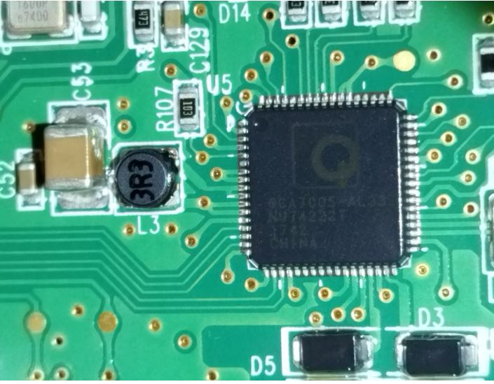
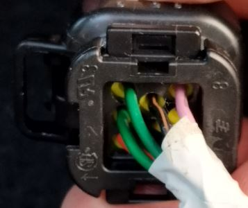

# Pictures

# General

Besides the main controller, a Freescale MPC5605B 32-bit-controller including CAN
(see https://www.nxp.com/products/processors-and-microcontrollers/power-architecture/mpc5xxx-microcontrollers/ultra-reliable-mpc56xx-mcus/ultra-reliable-mpc56xb-mcu-for-automotive-and-industrial-general-purpose:MPC560xB),
the interesting part is the QCA7005 PLC modem and the connected SPI flash memory. The connections between the SPI flash and the QCA are plausible matching to the schematic here: https://github.com/Millisman/QCA7000
It seems that the SPI flash exposes all necessary pins to well-labeled test points, so this is a good basis to read out the content of the SPI flash.

The PCB is "sealed" with a kind of protection seal. But, fortunately, the can be easily removed with alcohol.

# Vehicle side connector

- 1 PCANH (orange)
- 2 PCANL (green)
- 3 Control Pilot CP (green)
- 4 GND
- 5 Shield (GND)
- 6 Power (red)
- 7 not used, GND
- 8 Ignition input from F21 (pink)

Current consumption (when Power and Ignition are bridged): 9V/160mA or 13V/120mA

# Main controller
## Which controller type is used?
MPC5605BMLQ, 144pin

## Where is pin 1?
Right to the 45° corner. It is marked with a triangle on the PCB. Near to the 6-pin-connector CON13.
The counting of the pin number is supported by small marks on the PCP on each 5th pin. These are marking the pins 5, 10, 15, 20 and so on.

## Where are the pins for the debugger?
- PC0 = TDI = pin 126 = CON3.1
- PC1 = TDO = pin 121 = CON3.3
- PH9 = TCK = pin 127 = CON3.5
- PH10 = TMS = pin 120 = CON3.10

From connector CON3 point of view:
- CON3.1 = TDI (Debug interface)
- CON3.2 = GND
- CON3.3 = TDO (Debug interface)
- CON3.4 = GND
- CON3.5 = TCK (Debug interface)
- CON3.6 = GND
- CON3.7 = (pullup R43, what else?)
- CON3.8 = ?
- CON3.9 = NRESET µC pin21, C96 to ground. U16.3.
- CON3.10 = TMS (Debug interface)
- CON3.11 = VDD_HV, 3.3V, C95, C30, C37 to ground.
- CON3.12 = GND
- CON3.13 = ?
- CON3.14 = ?

## Power Supply

U17, L11: Down-Converter from 12V to 5V.
U2: 5V in, 3.3V out (Linear regulator)

## Reset circuit

- U16.1 via R117 to U16.8
- U16.2 is CON12.1, may be a jumper to disable the watchdog?
- U16.3 via C28 to GND
- U16.4 = GND

- U16.5 = GND
- U16.6 = TP near R55, µC.17 PE11. Square wave, 20ms off, 20ms on. 3.3V/0V. Looks like watchdog trigger.
- U16.7 provides the NRESET to the controller
- U16.8 = 5V supply, from D9, and the big L11

## Which SPI pins are used to drive the QCA from the microcontroller?

QCA.14 = SPI_slave_MOSI  =      µC.44 (with via) = PA13 = SOUT_0
QCA.15 = SPI_slave_MISO  =      µC.45 (with via) = PA12 = SIN_0
QCA.16 = SPI_slave_chipselect = µC.42 (with via) = PA14 = CS0_0
QCA.19 = SPI_slave_clock =      µC.40 (with via) = PA15 = SCK_0

After power-on of the CCM, the clock has packages of 16 cycles in 1.2µs, means 75ns per cycle, means 13MHz SPI clock.
Multiple of these 16-bit-packages are contained in one chip-select-low-phase. The length of the transmission is different,
up to 90µs.

## Which are the other SPI signals, between the QCA and the Flash?
QCA.3 = data_in = TP16 = flash.2 = SO
QCA.65 = chipselect = TP12 = flash.1 = chipselect
QCA.66 = data_out = TP11 = flash.5 = SI
QCA.67 = clock = TP10 = flash.6 = SCLK

## Flash memory U4
e.g. https://www.tme.eu/Document/90cf95a7114025302d33a68125e207ab/MX25L1606E.pdf
- pin 1: CS
- pin 2: SO
- pin 3: write protection. Pulled via R13 to VCC.
- pin 4: GND
- pin 5: SI
- pin 6: SCLK
- pin 7: hold (connected to VCC)
- pin 8: VCC, TP9

# Car Integration
## Does the Ioniq complain if the CCM is not installed?
No. AC charging still works. No error message in the dashboard.

# CAN Communication

## Which messages does the CCM transmit?

When no other control units are present on the CAN, the CCM is transmitting the following messages:
0x5E5 (100ms cycle)
0x5E6 (100ms cycle)
0x5E8 (100ms cycle)
0x5E9 (100ms cycle)

## Which CAN messages are necessary that the CCM sends a SlacParamReq?

By replaying an trace from vehicle, and filtering-out most of the messages, found out that are only three messages required by the CCM to
initiate a PLC communication:
- 0x57F unclear what this contains
- 0x597 contains a toggle bit and some other information
- 0x599 contains the "CCS trigger bit" (byte7, bit 0), which initiates the SLAC. Also the SOC in byte 2.

Using these three messages from the trace ioniq2018_motorCAN_500k_HPC.asc (from github.com/uhi22/IoniqMotorCAN/Traces), and replaying them against
a physical CCM unit, the CCM makes the SLAC, SDP and comes until PowerDeliveryReq, with 34% SOC. Afterwards it sends a SessionStopRequest.

