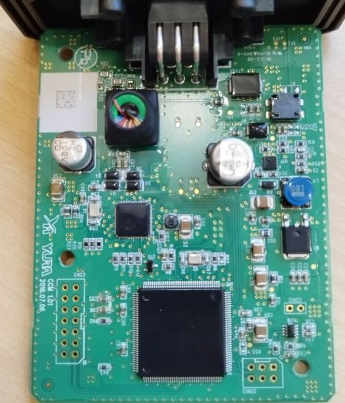
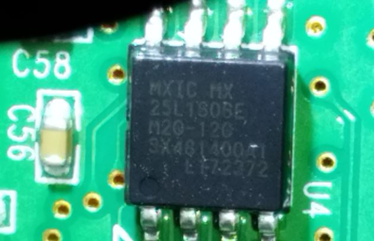
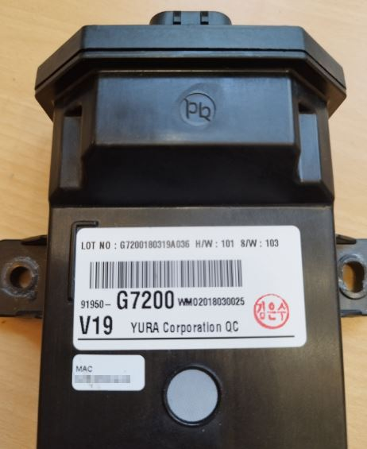
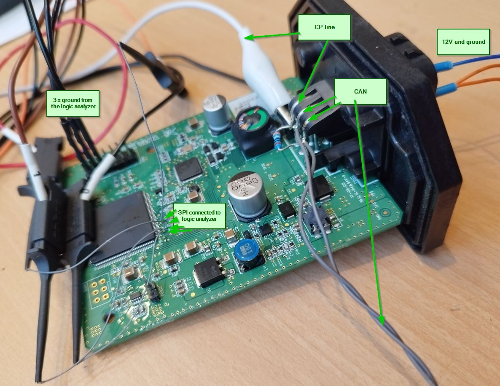

# Pictures

# General

Besides the main controller, a Freescale MPC5605B 32-bit-controller including CAN
(see https://www.nxp.com/products/processors-and-microcontrollers/power-architecture/mpc5xxx-microcontrollers/ultra-reliable-mpc56xx-mcus/ultra-reliable-mpc56xb-mcu-for-automotive-and-industrial-general-purpose:MPC560xB),
the interesting part is the QCA7005 PLC modem and the connected SPI flash memory. The connections between the SPI flash and the QCA are plausible matching to the schematic here: https://github.com/Millisman/QCA7000
It seems that the SPI flash exposes all necessary pins to well-labeled test points, so this is a good basis to read out the content of the SPI flash.

The PCB is "sealed" with a kind of protection seal. But, fortunately, the can be easily removed with alcohol.

# Vehicle side connector

- 1 PCANH (orange)
- 2 PCANL (green)
- 3 Control Pilot CP (green)
- 4 GND
- 5 Shield (GND)
- 6 Power (red)
- 7 not used, GND
- 8 Ignition input from F21 (pink)

Current consumption (when Power and Ignition are bridged): 9V/160mA or 13V/120mA

# Main controller

## Which controller type is used?

MPC5605BMLQ, 144pin

## Memory

### CodeFlash

- 768k according to data sheet. This is 0x00 to 0xB'FFFF.
- Shadow flash 0x20'0000 to 0x20'3FFF (according to https://www.nxp.com/files-static/32bit/doc/ref_manual/MPC5606BRM.pdf)
- 0x20'3dd8: FEED FACE CAFE BEEF
- 0x20'3FFF: last readable address
- Dumps: readout_codeflash_CCM_ioniq_00_33_79.s19 and readout_shadowflash_CCM_ioniq_00_33_79.s19

### DataFlash

- 64k according to data sheet.
- 0x80'0000 to 0x80'FFFF
- Dump: readout_dataflash_CCM_ioniq_00_33_79.s19
- The MAC address (which is used on SPI and PLC) is contained four times in the data flash, e.g. around 0x803E7E, after a kind of serial number.

## Where is pin 1?
Right to the 45° corner. It is marked with a triangle on the PCB. Near to the 6-pin-connector CON13.
The counting of the pin number is supported by small marks on the PCP on each 5th pin. These are marking the pins 5, 10, 15, 20 and so on.

## Where are the pins for the debugger?
- PC0 = TDI = pin 126 = CON3.1
- PC1 = TDO = pin 121 = CON3.3
- PH9 = TCK = pin 127 = CON3.5
- PH10 = TMS = pin 120 = CON3.10

From connector CON3 point of view:
- CON3.1 = TDI (Debug interface)
- CON3.2 = GND
- CON3.3 = TDO (Debug interface)
- CON3.4 = GND
- CON3.5 = TCK (Debug interface)
- CON3.6 = GND
- CON3.7 = (pullup R43, what else?)
- CON3.8 = ?
- CON3.9 = NRESET µC pin21, C96 to ground. U16.3.
- CON3.10 = TMS (Debug interface)
- CON3.11 = VDD_HV, 3.3V, C95, C30, C37 to ground.
- CON3.12 = GND
- CON3.13 = (not used)
- CON3.14 = (not used)

This is the same connector layout as described in https://www.isystem.com/files/content/downloads/documents/hardware-reference-manuals/Debug-Adapters-UM.pdf
for the 14-pin 2.54mm MPC5xxx Debug Adapter.

The debug interface is not protected. Reading out the memory works fine using a debugger. The only precondition is to add a bridge to CON12, to disable the watchdog.

## Power Supply

- U17, L11: Down-Converter from 12V to 5V.
- U2: 5V in, 3.3V out (Linear regulator)

## Reset circuit

- U16.1 via R117 to U16.8
- U16.2 is CON12.1; The CON12 needs to be shortened to disable the watchdog trigger for use with a debugger.
- U16.3 via C28 to GND
- U16.4 = GND

- U16.5 = GND
- U16.6 = TP near R55, µC.17 PE11. Square wave, 20ms off, 20ms on. 3.3V/0V. Looks like watchdog trigger.
- U16.7 provides the NRESET to the controller
- U16.8 = 5V supply, from D9, and the big L11

## Which SPI pins are used to drive the QCA from the microcontroller?

- QCA.14 = SPI_slave_MOSI  =      µC.44 (with via) = PA13 = SOUT_0
- QCA.15 = SPI_slave_MISO  =      µC.45 (with via) = PA12 = SIN_0
- QCA.16 = SPI_slave_chipselect = µC.42 (with via) = PA14 = CS0_0
- QCA.19 = SPI_slave_clock =      µC.40 (with via) = PA15 = SCK_0

## Deeper SPI analysis

After power-on of the CCM, the clock has packages of 16 cycles in 1.2µs, means 75ns per cycle, means 13MHz SPI clock.
Multiple of these 16-bit-packages are contained in one chip-select-low-phase. The length of the transmission is different,
up to 90µs.

SPI configuration: sampling on rising edge, shifting on falling edge (CPHA=1). Clock is high when inactive (CPOL=1). MSB first.

Using the saleae logic analyzer, recorded a trace of the SPI communication after power on of the CCM, and then replaying a CAN trace from car,
while on the CP line there was the pyPLC (on Raspberry) connected as EVSE. The charging session runs until ContractAuthentication.
Result here: [CCM_SPI_powerOn_and_SLAC_until_contractAuth.txt](CCM_SPI_powerOn_and_SLAC_until_contractAuth.txt)

The protocol is explained in the AN4 application note from InTech / I2SE, see an4_rev5_QCA7000_application_note_with_protocol.pdf.
The ethernet frames are visible in the above SPI trace after the 0xAAAAAAAA start-of-frame-markers, 2 bytes length information, 2 fill bytes.

Surprising fact is, that the MAC which is printed on the housing of the CCM is totally different to the MAC used in the PLC communication.
On the other hand, the MAC of the Raspberry EVSE is correctly visible on SPI, and also the CCM reports a
consistent MAC on SPI and on PLC, only the paper label on the housing differs.

## Which are the other SPI signals, between the QCA and the Flash?
QCA.3 = data_in = TP16 = flash.2 = SO
QCA.65 = chipselect = TP12 = flash.1 = chipselect
QCA.66 = data_out = TP11 = flash.5 = SI
QCA.67 = clock = TP10 = flash.6 = SCLK

## Flash memory U4
e.g. https://www.tme.eu/Document/90cf95a7114025302d33a68125e207ab/MX25L1606E.pdf
- pin 1: CS
- pin 2: SO
- pin 3: write protection. Pulled via R13 to VCC.
- pin 4: GND
- pin 5: SI
- pin 6: SCLK
- pin 7: hold (connected to VCC)
- pin 8: VCC, TP9

# Car Integration
## Does the Ioniq complain if the CCM is not installed?
No. AC charging still works. No error message in the dashboard.

# CAN Communication

## Which messages does the CCM transmit?

When no other control units are present on the CAN, the CCM is transmitting the following messages:
0x5E5 (100ms cycle)
0x5E6 (100ms cycle)
0x5E8 (100ms cycle)
0x5E9 (100ms cycle)

## Which CAN messages are necessary that the CCM sends a SlacParamReq?

By replaying an trace from vehicle, and filtering-out most of the messages, found out that are only three messages required by the CCM to
initiate a PLC communication:
- 0x57F unclear what this contains
- 0x597 contains a toggle bit and some other information
- 0x599 contains the "CCS trigger bit" (byte7, bit 0), which initiates the SLAC. Also the SOC in byte 2.

Using these three messages from the trace ioniq2018_motorCAN_500k_HPC.asc (from github.com/uhi22/IoniqMotorCAN/Traces), and replaying them against
a physical CCM unit, the CCM makes the SLAC, SDP and comes until PowerDeliveryReq, with 34% SOC. Afterwards it sends a SessionStopRequest.

### Reconstruction of the start of a CCS charging session

(Timing from the CAN trace with alpitronics charger)
1. t=0: After plugging in and applying the 5% PWM, this first activity on CAN is 5D7_1_CCS_firstTrigger=1
2. t=596ms: CCS_COMMS_TRIGGER = 1
3. t=600ms: 5D7_1_CcsStart = 1.
4. t=6.9s: CCM_CCS_TCP_connected = 1
5. t=8.5s: CCM_ChargeProgress=1 (ConnectorLocking request?)
6. 5D7_4_remainingTimeBulk indicates the time until bulk charge complete
7. 5D7_0_ConnectorLockConfirm=1 Confirms the connector lock (?)
8. CCM_ChargeProgress changes to CableCheck (3)
9. 542_78_UCCS ramps up to 500V.
10. After 9.5s cable check, the voltage ramps down.
11. When the voltage is below 6V, the CCM_ChargeProgress changes to PreCharge.
12. After 0.9s, this is confirmed by the 5D7_1.1 PreChCnf
13. CCM_ChargeProgress changes to PowerDeliveryStart
14. 5D7_1.4_ContactorsClosed confirmes the closed contactors
15. CCM_ChargeProgress changes to CurrentDemand
16. Current is ramping up. Charging.
17. 5D7_4_remainingTimeBulk is decreasing each minute by 60s.
18. When charging ends, the CCM_ChargeProgress changes to 63 (PowerDeliveryStop).
19. 5D7_0_ConnectorLockConfirm changes to 0. (This is too early for a connector unlocking. Maybe its an other signal.)
20. The inlet voltage (542_78_UCCS) is ramping down.
21. CCM_ChargeProgress 127 (WeldingDetection).

