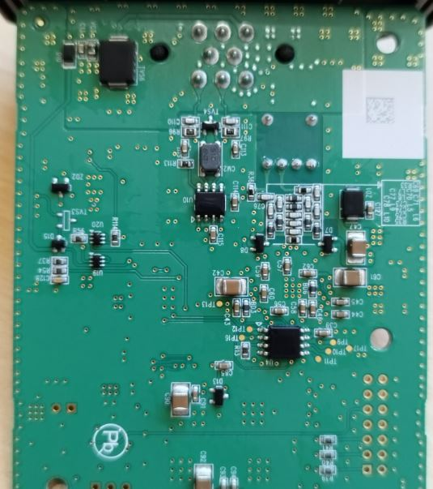
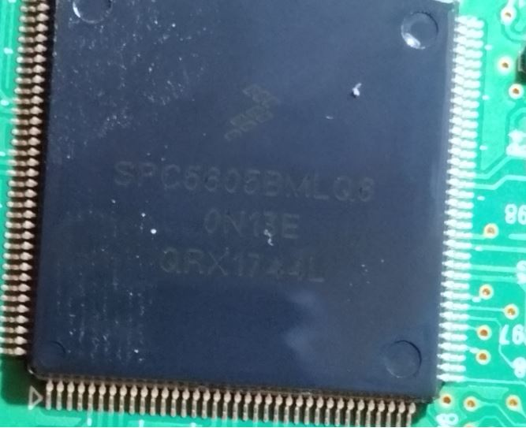
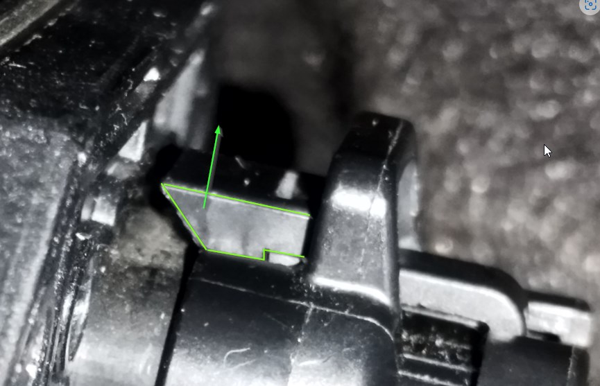
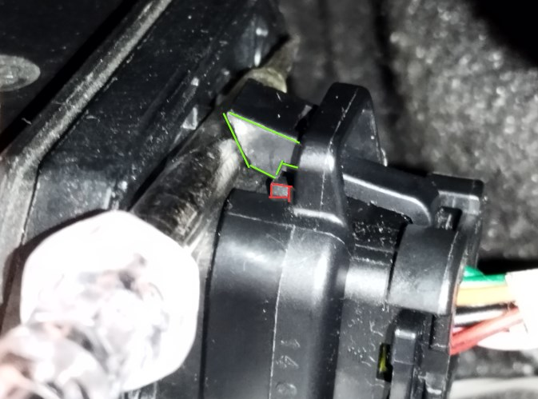
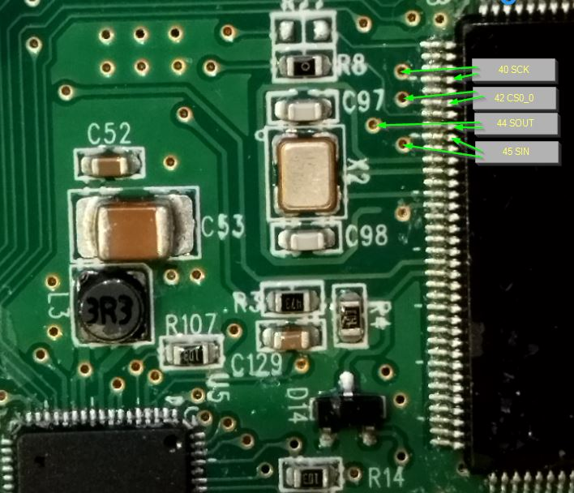
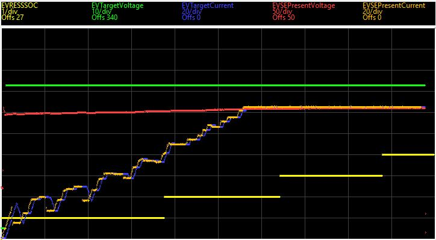
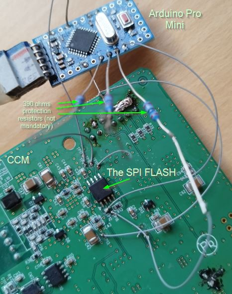

# Pictures

# General

Besides the main controller, a Freescale MPC5605B 32-bit-controller including CAN
(see https://www.nxp.com/products/processors-and-microcontrollers/power-architecture/mpc5xxx-microcontrollers/ultra-reliable-mpc56xx-mcus/ultra-reliable-mpc56xb-mcu-for-automotive-and-industrial-general-purpose:MPC560xB),
the interesting part is the QCA7005 PLC modem and the connected SPI flash memory. The connections between the SPI flash and the QCA are plausible matching to the schematic here: https://github.com/Millisman/QCA7000
It seems that the SPI flash exposes all necessary pins to well-labeled test points, so this is a good basis to read out the content of the SPI flash.

The PCB is "sealed" with a kind of protection seal. But, fortunately, the can be easily removed with alcohol.

# Vehicle side connector

- 1 PCANH (orange)
- 2 PCANL (green)
- 3 Control Pilot CP (green)
- 4 GND
- 5 Shield (GND)
- 6 Power (red)
- 7 not used, GND
- 8 Ignition input from F21 (pink)

Current consumption (when Power and Ignition are bridged): 9V/160mA or 13V/120mA

## Unlocking of the connector

# Main controller

## Which controller type is used?

MPC5605BMLQ, 144pin

## Memory

### CodeFlash

- 768k according to data sheet. This is 0x00 to 0xB'FFFF.
- Shadow flash 0x20'0000 to 0x20'3FFF (according to https://www.nxp.com/files-static/32bit/doc/ref_manual/MPC5606BRM.pdf)
- 0x20'3dd8: FEED FACE CAFE BEEF
- 0x20'3FFF: last readable address
- Dumps: [readout_codeflash_CCM_ioniq_00_33_79.s19](readout_codeflash_CCM_ioniq_00_33_79.s19) and [readout_shadowflash_CCM_ioniq_00_33_79.s19](readout_shadowflash_CCM_ioniq_00_33_79.s19)

### DataFlash

- 64k according to data sheet.
- 0x80'0000 to 0x80'FFFF
- Dump: [readout_dataflash_CCM_ioniq_00_33_79.s19](readout_dataflash_CCM_ioniq_00_33_79.s19)
- The MAC address (which is used on SPI and PLC) is contained four times in the data flash, e.g. around 0x803E7E, after a kind of serial number.

## Where is pin 1?
Right to the 45° corner. It is marked with a triangle on the PCB. Near to the 6-pin-connector CON13.
The counting of the pin number is supported by small marks on the PCP on each 5th pin. These are marking the pins 5, 10, 15, 20 and so on.

## Where are the pins for the debugger?
- PC0 = TDI = pin 126 = CON3.1
- PC1 = TDO = pin 121 = CON3.3
- PH9 = TCK = pin 127 = CON3.5
- PH10 = TMS = pin 120 = CON3.10

From connector CON3 point of view:
- CON3.1 = TDI (Debug interface)
- CON3.2 = GND
- CON3.3 = TDO (Debug interface)
- CON3.4 = GND
- CON3.5 = TCK (Debug interface)
- CON3.6 = GND
- CON3.7 = (pullup R43, what else?)
- CON3.8 = ?
- CON3.9 = NRESET µC pin21, C96 to ground. U16.3.
- CON3.10 = TMS (Debug interface)
- CON3.11 = VDD_HV, 3.3V, C95, C30, C37 to ground.
- CON3.12 = GND
- CON3.13 = (not used)
- CON3.14 = (not used)

This is the same connector layout as described in https://www.isystem.com/files/content/downloads/documents/hardware-reference-manuals/Debug-Adapters-UM.pdf
for the 14-pin 2.54mm MPC5xxx Debug Adapter.

The debug interface is not protected. Reading out the memory works fine using a debugger. The only precondition is to add a bridge to CON12, to disable the watchdog.

## Power Supply

- U17, L11: Down-Converter from 12V to 5V.
- U2: 5V in, 3.3V out (Linear regulator)

## Reset circuit

- U16.1 via R117 to U16.8
- U16.2 is CON12.1; The CON12 needs to be shortened to disable the watchdog trigger for use with a debugger.
- U16.3 via C28 to GND
- U16.4 = GND
- U16.5 = GND
- U16.6 = TP near R55, µC.17 PE11. Square wave, 20ms off, 20ms on. 3.3V/0V. Looks like watchdog trigger.
- U16.7 provides the NRESET to the controller
- U16.8 = 5V supply, from D9, and the big L11

## Which SPI pins are used to drive the QCA from the microcontroller?

- QCA.14 = SPI_slave_MOSI  =      µC.44 (with via) = PA13 = SOUT_0
- QCA.15 = SPI_slave_MISO  =      µC.45 (with via) = PA12 = SIN_0
- QCA.16 = SPI_slave_chipselect = µC.42 (with via) = PA14 = CS0_0
- QCA.19 = SPI_slave_clock =      µC.40 (with via) = PA15 = SCK_0

## Deeper SPI analysis

After power-on of the CCM, the clock has packages of 16 cycles in 1.2µs, means 75ns per cycle, means 13MHz SPI clock.
Multiple of these 16-bit-packages are contained in one chip-select-low-phase. The length of the transmission is different,
up to 90µs.

SPI configuration: sampling on rising edge, shifting on falling edge (CPHA=1). Clock is high when inactive (CPOL=1). MSB first.

Using the saleae logic analyzer, recorded a trace of the SPI communication after power on of the CCM, and then replaying a CAN trace from car,
while on the CP line there was the pyPLC (on Raspberry) connected as EVSE. The charging session runs until ContractAuthentication.
Result here: [CCM_SPI_powerOn_and_SLAC_until_contractAuth.txt](CCM_SPI_powerOn_and_SLAC_until_contractAuth.txt)

Pitfalls regarding the "Saleae" logic analyzers: The cheap clones (~15 Euros, 8 channel), with 24MHz sampling rate, do NOT work, because this sampling
rate is too slow to catch the 13MHz SPI clock. The "medium expensive clones (~70 Euros)", 16 channels, sometimes labeled "Logic 16", are working ok with the setting 32MS/s, but the clock signal is not as accurate as seen on an oscilloscope (should be 16 clock pulses per transaction, equally distributed).

The protocol is explained in the AN4 application note from InTech / I2SE, see an4_rev5_QCA7000_application_note_with_protocol.pdf.
The ethernet frames are visible in the above SPI trace after the 0xAAAAAAAA start-of-frame-markers, 2 bytes length information, 2 fill bytes.

Using a python script [spiInterpreter.py](spiInterpreter.py) the SPI trace can be converted into a pcap file (example [CCM_SPI_powerOn_and_SLAC_until_contractAuth.txt.pcap](CCM_SPI_powerOn_and_SLAC_until_contractAuth.txt.pcap), which can be inspected using
wireshark and further processed to make the V2G/EXI content visible (e.g. with https://github.com/uhi22/pyPLC/blob/master/pcapConverter.py and https://github.com/uhi22/pyPLC/blob/master/scope.py).

SPI trace of a complete charging session on a Compleo 50kW triple charger:
- [ccm_spi_ioniq_compleo_full_charge_sequence_ended_on_charger.txt](ccm_spi_ioniq_compleo_full_charge_sequence_ended_on_charger.txt) is the SPI trace made with Saleae, exported as csv. Saleae was configured for 50MS/s, 4 digital lines. There are two ways to export the decoded data from Saleae 2: 1. The 3-dot-menu right to the SPI chapter, this allows to export TXT/CSV. Or the 3-dot-menu in the data chapter, which says "export table" and also allows CSV export. The formats differ a little bit (number of colums, header texts), but both are ok and are interpreted by the spiInterpreter.py.
- [ccm_spi_ioniq_compleo_full_charge_sequence_ended_on_charger.txt.pcap](ccm_spi_ioniq_compleo_full_charge_sequence_ended_on_charger.txt.pcap) is converted from the SPI trace into pcap network trace, using spiInterpreter.py.
- [ccm_spi_ioniq_compleo_full_charge_sequence_ended_on_charger.txt.pcap.decoded.txt](ccm_spi_ioniq_compleo_full_charge_sequence_ended_on_charger.txt.pcap.decoded.txt) and [ccm_spi_ioniq_compleo_full_charge_sequence_ended_on_charger.txt.pcap.values.txt](ccm_spi_ioniq_compleo_full_charge_sequence_ended_on_charger.txt.pcap.values.txt) is made from the pcap, using pyPLC/pcapConverter.py.
- Finally, the curves from the ...values.txt, using pyPLC/scope.py:

Surprising fact is, that the MAC which is printed on the housing of the CCM is totally different to the MAC used in the PLC communication.
On the other hand, the MAC of the Raspberry EVSE is correctly visible on SPI, and also the CCM reports a
consistent MAC on SPI and on PLC, only the paper label on the housing differs.

### Alpitronic HYC300 log

spi_ioniq_alpiHYC300_SWIsued_2024-03-22_ok_stopOnCharger.csv.pcap

* During the precharge, the ioniq requests 1A precharge current. This is the good case, not the bug which muxsan had in his implementation until March 2024.
* The alpitronic does NOT report limit power at the beginning of the current demand loop. Three observations during this phase:
    * The ioniq ramps up the EVTargetCurrent quite fast (starting with 1A, and ramping up ~1A per message, reaching 148A after 15s).
    * The alpi nearly follows with EVSEPresentCurrent the request of the ioniq.
    * The alpi reports max 229A and max 82kW, no limitation.
Conclusion: This seems to be the "old" alpi software, which does NOT limit the power during ramp-up.

Cross-links to the discussions:
* https://www.goingelectric.de/forum/viewtopic.php?p=2203585#p2203585
* Emiles observations on new alpitronic software https://www.goingelectric.de/forum/viewtopic.php?p=2202897#p2202897

### SPI frames

When starting a charging session, we see the following sequence. The symbolic names are taken from the QCA7000 linux driver (https://github.com/qca/qca7000).

- C2 00 00 00 Read, internal, reg 2 (WRBUF_SPC_AVA)
- C2 00 00 00 Read, internal, reg 2 (WRBUF_SPC_AVA)
- C2 00 00 00 Read, internal, reg 2 (WRBUF_SPC_AVA)
- DA 00 00 00 Read, internal, reg 1A (SIGNATURE)
- This repeats multiple times, until the response in the DA 00 00 00 is 3F FF FF FF.
- CD 00 00 00 Read, internal, reg 0D (INTR_ENABLE)
- 4D 00 00 00 Write, internal, reg 0D (INTR_ENABLE) disables the interrupt.
- CC 00 00 00 -> * * 04 40 Read, internal, reg 0C (INTR_CAUSE)
- DA 00 00 00 -> * * AA 55 This is the expected signature GOOD_SIGNATURE.
- DA 00 00 00 -> * * AA 55 This is the expected signature GOOD_SIGNATURE.
- C2 00 00 00 -> * * 0C 5B The first correct write buffer space available info.
- 4C 00 04 40 Write, internal, reg 0C (INTR_CAUSE). Confirms all interrupt bits which have been seen above.
- CD 00 00 00 -> * * 00 00 Read, internal, reg 0D (INTR_ENABLE)
- 4D 00 00 47 Write, internal, reg 0D (INTR_ENABLE) enables some interrupts (SPI_INT_WRBUF_BELOW_WM, SPI_INT_WRBUF_ERR, SPI_INT_RDBUF_ERR, SPI_INT_PKT_AVLBL).
- C2 00 00 00 Read, internal, reg 2 (WRBUF_SPC_AVA)
- C2 00 00 00 Read, internal, reg 2 (WRBUF_SPC_AVA)
- 41 00 00 58 Write, internal, reg 1 (BFR_SIZE)
- 00 00 (Write, external) AA AA AA AA - 4E 00 00 00 (size)- 33 33 FF FF D3 E2 (dst MAC)- E0 0E E1 FF D3 E2 (src MAC) - 86DD (IPv6) - 60 00 00 00 - 0018 - 3A (ICMP) .... Neighbor Solicitation.

This means, the CCM tries to find Neighbors in the network, even before the SLAC is started. Strange.

- C2 00 00 00 Read, internal, reg 2 (WRBUF_SPC_AVA)
- C2 00 00 00 Read, internal, reg 2 (WRBUF_SPC_AVA)
- 41 00 00 46  Write, internal, reg 1 (BFR_SIZE)
- 00 00 AA AA AA AA - 3C 00 00 00 - FF FF FF FF FF FF - E0 0E E1 FF D3 E2 -88E1 (homeplug) ... SlacParamReq
- C2 00 00 00 Read, internal, reg 2 (WRBUF_SPC_AVA)
- The CCM repeats the SlacParamReq each 210ms, until it sees a SlacParamCnf.
- CD 00 00 00 -> * * 00 47 Read, internal, reg 0D (INTR_ENABLE)
- 4D 00 00 00 -> Write, internal, reg 0D (INTR_ENABLE) 
- CC 00 00 00 -> 47 47 04 01 Read, internal, reg 0C (INTR_CAUSE) SPI_INT_WRBUF_BELOW_WM, SPI_INT_PKT_AVLBL
- C3 00 00 00 -> * * 00 4A Read, internal, reg 03 (RDBUF_BYTE_AVA) shows that 4A bytes are in receive buffer.
- 41 00 00 4A  Write, internal, reg 1 (BFR_SIZE)
- 80 00 (Read, external)  00 ..... --> * * 00 00 00 46 - AA AA AA AA - 3C 00 00 00 - E0 0E E1 FF D3 E2 - .... SlacParamCnf
- 4C 00 04 01 Write, internal, reg 0C (INTR_CAUSE). This confirms the above seen interrupt flags.
- CD 00 00 00 -> * * 00 00 Read, internal, reg 0D (INTR_ENABLE)

## Which are the other SPI signals, between the QCA and the Flash?
- QCA.3 = data_in = TP16 = flash.2 = SO
- QCA.65 = chipselect = TP12 = flash.1 = chipselect
- QCA.66 = data_out = TP11 = flash.5 = SI
- QCA.67 = clock = TP10 = flash.6 = SCLK

## Where is the reset pin of the QCA?

QCA.5 is the reset input. External pull-up R107 to VCC (C59, C50, U2). TP13 on the bottom side.

## Flash memory U4
e.g. https://www.tme.eu/Document/90cf95a7114025302d33a68125e207ab/MX25L1606E.pdf
- pin 1: CS
- pin 2: SO
- pin 3: write protection. Pulled via R13 to VCC.
- pin 4: GND
- pin 5: SI
- pin 6: SCLK
- pin 7: hold (connected to VCC)
- pin 8: VCC, TP9

## How to read out the SPI flash memory U4?

Hold the QCA in reset, by connecting TP13 to ground.
Connect an Arduino to the four SPI lines of the U4. Use the Arduino sketch Arduino_SpiFlash. (Adjust the memory size to read out and maybe the format as wanted.)
Connect the power of the Arduino to the 3,3V (TP9). Do not power the Arduino externally. Store the output of the Arduinos serial to a file (e.g. using Putty on the COM port).
The created s19 (Motorola SRecord) file can be converted to binary using e.g. the srec_cat from https://srecord.sourceforge.net/:
`"C:\Program Files\srecord\bin\srec_cat.exe" CCM_FlashDump_SpiFlash_2MB_Ioniq_00_33_79.s19 -Output CCM_FlashDump_SpiFlash_2MB_Ioniq_00_33_79.bin -Binary`

Alternatively, a RaspberryPi may be used to read and write the SPI flash:
https://www.rototron.info/recover-bricked-bios-using-flashrom-on-a-raspberry-pi/ 
Make sure that SPI is enabled in the settings of the Raspberry.
Install the flashrom tool: `sudo apt-get install flashrom`
The docu of flashrom is here: https://www.flashrom.org/Flashrom
Check whether the device is detected: `flashrom -p linux_spi:dev=/dev/spidev0.0,spispeed=2000 -V`

For viewing the binary, a hex editor can be used, e.g. http://www.funduc.com/fshexedit.htm

## Memory dump of the SPI flash U4

See [CCM_FlashDump_SpiFlash_2MB_Ioniq_00_33_79.s19](CCM_FlashDump_SpiFlash_2MB_Ioniq_00_33_79.s19). First analysis results:
- 0x00'0140 to 0x00'240: Build version information (e.g. "QCA7000 MAC SW v1.1.0 Rev:04" ...)
- 0x00'3BC0 ...: a lot of error message strings
- 0x01'0200 Firmware version. Surprisingly, it reports a FW-QCA7420-1.1.0.730-04-CS-20140815, not a QCA7000 or 7005.
- 0x06'3D40 End of the firmware
- 0x0E'0000 Start of configuration block
- 0x0E'0200 PIB version "PIB-QCA7420-1.1.0.730-05-CS-20140815"
- 0x0E'0430 "YURA CCM SOP DEFAULT" (Yura is the module manufacturer, printed on the PCB and housing label)
- 0x0E'4000 Again start of configuration block, with same (or similar?) content as above
- 0x0F'0000 Again start of configuration block, with same (or similar?) content as above
- 0x0F'4000 Again start of configuration block, with same (or similar?) content as above
- 0x14'0000 Firmware identification block, similar (or same?) as on 0x01'0000.
- 0x19'3D40 End of the second firmware

Comparing to the content of another CCM (CCM_FlashDump_SpiFlash_2MB_Ioniq_00_64_C3.s19), the difference is quite small and only in the configuration
blocks 0x0E'0360 and 0x0F'0360.

# Car Integration
## Does the Ioniq complain if the CCM is not installed?
No. AC charging still works. No error message in the dashboard.

# CAN Communication

## Which messages does the CCM transmit?

When no other control units are present on the CAN, the CCM is transmitting the following messages:
0x5E5 (100ms cycle)
0x5E6 (100ms cycle)
0x5E8 (100ms cycle)
0x5E9 (100ms cycle)

## Which CAN messages are necessary that the CCM sends a SlacParamReq?

By replaying an trace from vehicle, and filtering-out most of the messages, found out that are only three messages required by the CCM to
initiate a PLC communication:
- 0x57F unclear what this contains
- 0x597 contains a toggle bit and some other information
- 0x599 contains the "CCS trigger bit" (byte7, bit 0), which initiates the SLAC. Also the SOC in byte 2.

Using these three messages from the trace ioniq2018_motorCAN_500k_HPC.asc (from github.com/uhi22/IoniqMotorCAN/Traces), and replaying them against
a physical CCM unit, the CCM makes the SLAC, SDP and comes until PowerDeliveryReq, with 34% SOC. Afterwards it sends a SessionStopRequest.

### Reconstruction of the start of a CCS charging session

(Timing from the CAN trace with alpitronics charger)
1. t=0: After plugging in and applying the 5% PWM, this first activity on CAN is 5D7_1_CCS_firstTrigger=1
2. t=596ms: CCS_COMMS_TRIGGER = 1
3. t=600ms: 5D7_1_CcsStart = 1.
4. t=6.9s: CCM_CCS_TCP_connected = 1
5. t=8.5s: CCM_ChargeProgress=1 (ConnectorLocking request?)
6. 5D7_4_remainingTimeBulk indicates the time until bulk charge complete
7. 5D7_0_ConnectorLockConfirm=1 Confirms the connector lock (?)
8. CCM_ChargeProgress changes to CableCheck (3)
9. 542_78_UCCS ramps up to 500V.
10. After 9.5s cable check, the voltage ramps down.
11. When the voltage is below 6V, the CCM_ChargeProgress changes to PreCharge.
12. After 0.9s, this is confirmed by the 5D7_1.1 PreChCnf
13. CCM_ChargeProgress changes to PowerDeliveryStart
14. 5D7_1.4_ContactorsClosed confirmes the closed contactors
15. CCM_ChargeProgress changes to CurrentDemand
16. Current is ramping up. Charging.
17. 5D7_4_remainingTimeBulk is decreasing each minute by 60s.
18. When charging ends, the CCM_ChargeProgress changes to 63 (PowerDeliveryStop).
19. 5D7_0_ConnectorLockConfirm changes to 0. (This is too early for a connector unlocking. Maybe its an other signal.)
20. The inlet voltage (542_78_UCCS) is ramping down.
21. CCM_ChargeProgress 127 (WeldingDetection).

