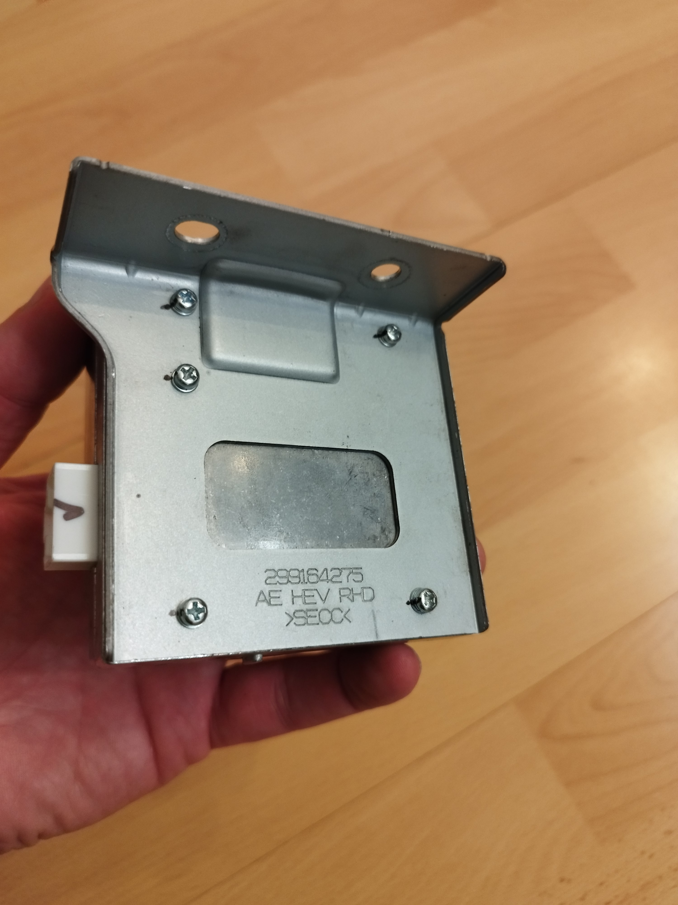
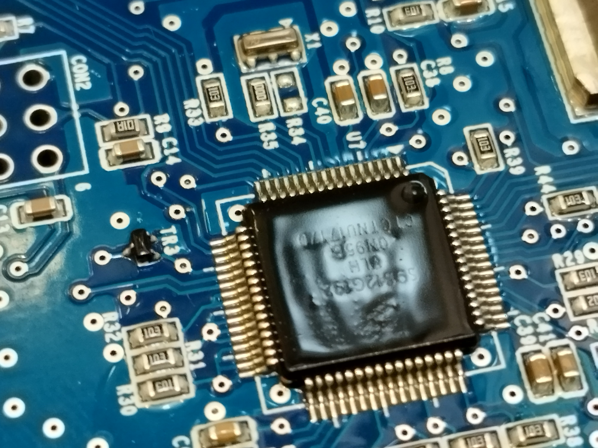
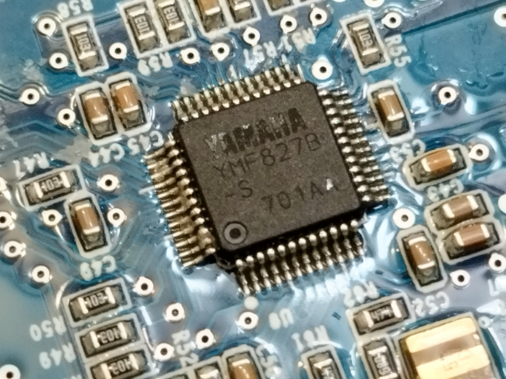
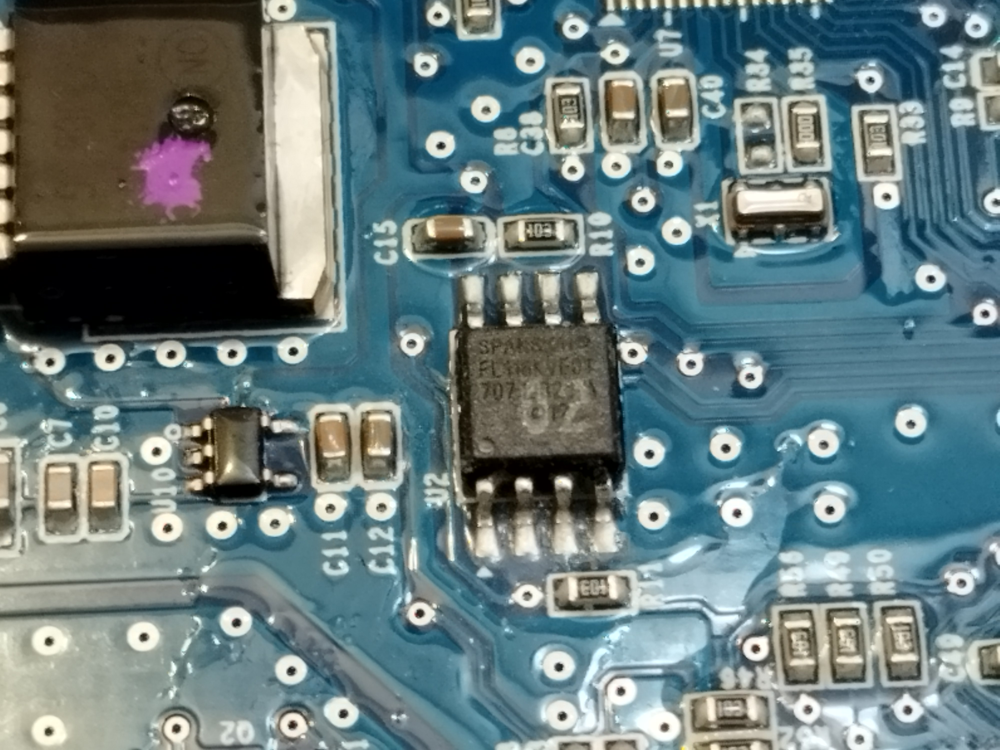

# VESS

Reads the speed and the gear selection from CAN, and sends an engine sound and reverse-bing to a speaker







YAMAHA YMF827B see Ref6


SPI Flash SPANSION FL116 KVF01 (or KVE01?) S25FL116K 16 MBit see Ref5



## Harness Connector

- 2x6 pin

- 1 (green) PCAN L
- 2 (orange) PCAN H
- 3 (black) ground
- 4 (vio) VESS button to ground
- 5 (red) +12V
- 6 (white) VESS speaker +
- 7 nc (on PCB, this is connected to RXD0 of the microcontroller via protection circuits)
- 8 nc (on PCB, this is routed to TXD0 of the microcontroller via protection circuits)
- 9 (black) ground
- 10 nc
- 11 (blue) VESS LED to ground
- 12 (brown) VESS speaker -

## CAN communication

The VESS transmits on CAN with 500kBaud.
It sends the message 5E3, 8 bytes, all zero. Cycle time is 1 second. This is the same as observed on the Kona in Ref1.

According Ref1, the Kona VESS needs just these messages to provide a sound:
```
200 : 00 28 00 10 00 3B D0 00 for gear
524 : 60 01 02 40 5A 01 C0 02 for speed
```
The Ioniq VESS is still silent, if we sent these messages with 100ms cycle time.

0x200 byte 1 is gear:
P 0x80
D 0xA8
N 0xB0
R 0xB8

0x524 byte 2 and 3 are speed. Always positive.
byte 6 is speed with sign. Reverse is negative.

### Diagnostic Communication

* Broadcast on 7DF with 02 3E 00 (Tester present) leads to 73E 02 7E 00 (positive response)
* Physical request on 736 leads to positive response on 73E.
* 02 3E 00 (Tester Present) -> 7E 00 (pos)
* 02 10 01 (Default session ) -> 50 01 (pos)
* 02 10 03 (Extended session ) -> 50 03 (pos)
* 03 22 F1 AB (read identification) -> 7F 22 31 (request out of range (Ref7))
* 01 19 (read DTCs) -> nrc 12 subFunctionNotSupported
* 03 19 02 08 (read DTC, by status mask, 8) -> 03 59 02 08 AA AA AA (pos, empty)
* 03 19 02 09 (read DTC, by status mask, 9) -> 03 59 02 09 AA AA AA (pos, empty)
* 03 19 02 0A (read DTC, by status mask, A) -> 03 7F 19 31 (request out of range)

* 22 F100 -> "060"
* 22 F187 -> first frame "963" could be the first part of the part number. Printed label 96390-G2100
* 22 F18B -> 62 F18B 20 15 10 19
* 22 F193 -> "100" could be the hardware or software version. On the printed label 1.00 for both.
* 22 F195 -> "100" could be the hardware or software version. On the printed label 1.00 for both.

* 14 ClearDTCs?
* 23 ReadMemoryByAddress?

## Microcontroller

Freescale / NXP 9S12G192VLH, 64pin. See Ref10.
192kB Flash

### How to read the controllers memory?

* Interface between BDM and USB: USBDM Programmer JS16 JM16 BDM/OSBDM OSBDM Download Debugger Emulator Downloader 48MHz USB 2.0 (JS16)
* Software: https://sourceforge.net/projects/usbdm/files/Version%204.12.1/Software/


## Power Amplifier

TDA7396
* Pin 4: CD-DIA (open collector) is low during error condition (clipping, thermal, openload, shortcut)
* Pin 8: STAND-BY high means fully operational, low means standby
* Pin 11: MUTE can be pulled to ground via series resistor for muting

## References

* Ref1 Youtube and github for the Kona VESS https://youtu.be/OLT1aKdpYhs and https://github.com/ereuter/vess
* Ref2 goingelectric: installation position of VESS control unit and speaker https://www.goingelectric.de/forum/viewtopic.php?p=529521#p529521 and https://www.goingelectric.de/forum/viewtopic.php?p=540312#p540312
* Ref3 schematic of the VESS integration https://service.hyundai-motor.com/UPLOAD/data/Passenger/HY/HME/DEU/ETM-IMAGES/HY-AE22-IMAGES-DEU/eaeevsd17314ag.svg
* Ref4 internal block diagram of the VESS https://www.goingelectric.de/forum/viewtopic.php?p=540312#p540312
* Ref5 data sheet of the SPI flash https://www.mouser.com/datasheet/2/380/S25FL116K_00-274912.pdf?srsltid=AfmBOooF0maW2Ar8tsxoBHCp190RUxyHD0BjgixwFOKB7HmAxDmbMZNP
* Ref6 sound generator YAMAHA https://device.yamaha.com/en/lsi/products/sound_generator/
* Ref7 UDS services and response codes https://automotive.wiki/index.php/ISO_14229
* Ref8 UDS service 19 subfunction list https://piembsystech.com/read-dtc-information-service-0x19-uds-protocol/
* Ref9 Data sheet of the power amplifier https://www.st.com/resource/en/datasheet/tda7396.pdf
* Ref10 Data sheet 9S12G family https://www.mouser.de/datasheet/2/302/MC9S12GRMV1-1359997.pdf